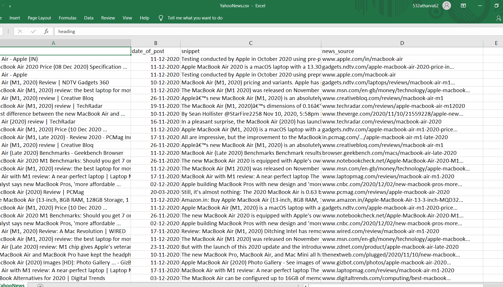

# Yahoo News Web Scraper 
            

* Yahoo News Web Scraper is used to extract data from each and article of **Yahoo News** search page and stores that data into **.csv** file. We just have to enter the name of the topic you are looking and script will fo your job.
* This is a screenshot of .csv file.
    
    * 

## Features

* From each page it extracts each and every articles following information:   
    1. Heading
    1. Date of post
    1. Snippet
    1. News Source

## Overview

* With the help of python script data scraping is done in this project. Python BeautifulSoup library does the major role in it. Along with that request library is also used. You can check entire code in scraple.py
* Csv package is used to store all the extracted data into YahooNews.csv file. 

